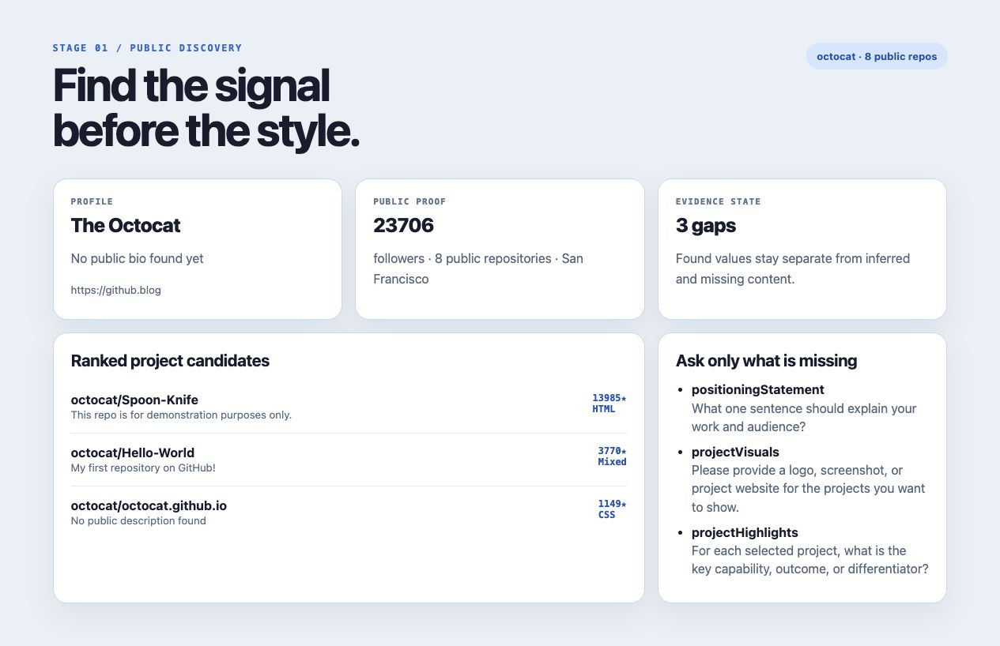
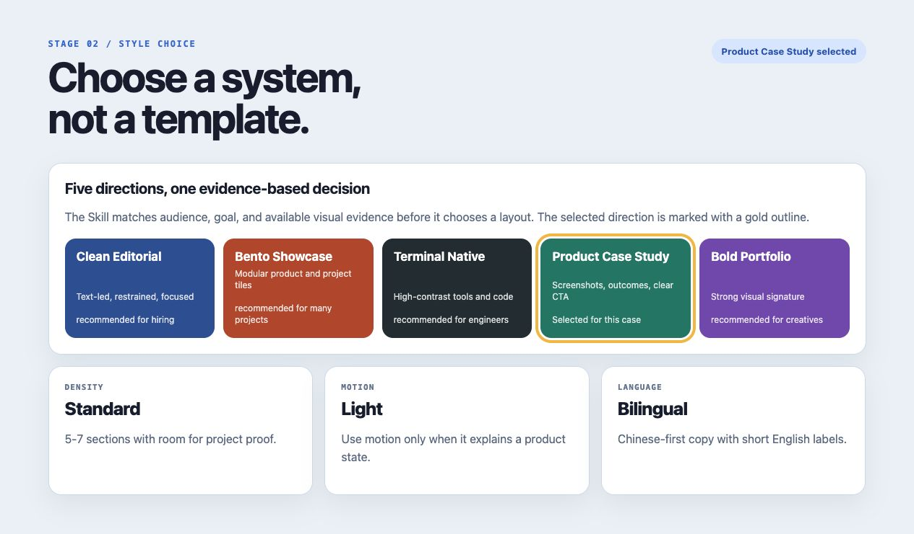
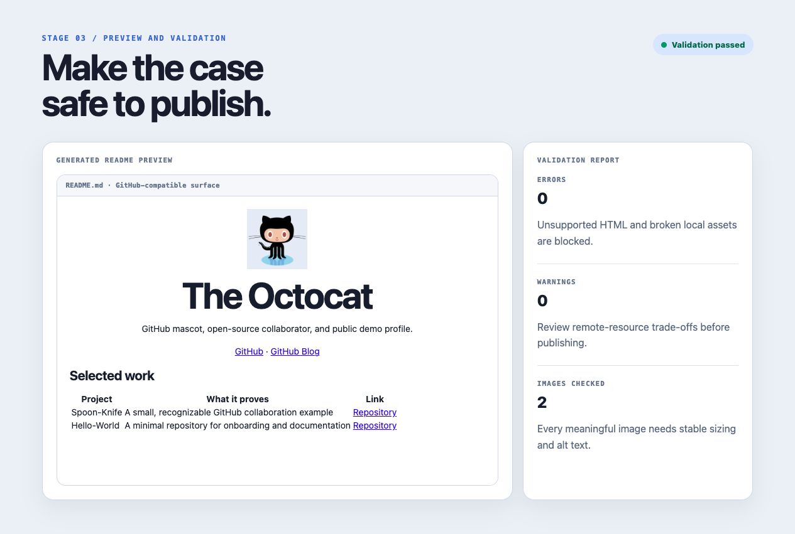

# GitHub Profile Designer

用公开 GitHub 信息，做出真正属于你的 Profile README。

[English version](README.en.md) · [Skill source](SKILL.md) · [Issue tracker](https://github.com/MSNirvana/github-profile-designer/issues)

`github-profile-designer` 是一个通用 Codex Skill：它先搜索 GitHub 用户和公开仓库，再补问缺失信息，帮助选择视觉风格，生成 README 案例，执行 GitHub 兼容性检查，最后导出文件或在确认后发布到用户自己的 Profile 仓库。

它不是一个固定模板，也不绑定任何个人 IP、公司品牌或素材库。每次生成都会重新读取用户的完整公开仓库集合，不会默认沿用上一次 README 的项目选择。

## 工作流

```text
公开资料发现  ->  缺失信息补问  ->  风格选择  ->  README 案例  ->  预览与校验  ->  导出 / 发布
```

下面的截图来自一次真实的 `octocat` 公开资料演练。截图素材由 `scripts/discover-profile.mjs`、`scripts/render-preview.mjs` 和 `scripts/validate-readme.mjs` 生成。

### 1. 发现公开资料

先读取用户信息和完整公开仓库集合，再读取仓库描述、语言、Topics、Star、Fork、README 图片、项目网站和 Logo 候选，并把“已找到”和“需要补充”分开。



### 2. 选择视觉方向

根据用户目标、受众和项目素材选择风格，而不是把所有徽章和组件堆在一起。当前内置五种方向：

| 风格 | 适合场景 |
| --- | --- |
| Clean Editorial | 招聘、研究、咨询、个人维护者 |
| Bento Showcase | 多产品、独立开发者、项目较多 |
| Terminal Native | CLI、基础设施、工具型开源项目 |
| Product Case Study | 创业者、产品工程师、客户项目 |
| Bold Portfolio | 创意技术、演讲者、设计型开发者 |



### 3. 生成、预览和校验

Skill 会输出可复制的 `README.md`、资源目录、素材来源清单和发现数据。预览器用于检查层级、图片和响应式宽度；校验器会拦截脚本、iframe、危险链接、缺失本地图片和缺少 alt 文本等问题。



## 安装

把仓库放到 Codex 的 Skills 目录即可：

```bash
git clone https://github.com/MSNirvana/github-profile-designer.git ~/.codex/skills/github-profile-designer
```

如果你的环境使用 `CODEX_HOME`，将 `~/.codex` 替换为 `$CODEX_HOME`。

## 使用方式

在 Codex 中直接提出类似请求：

```text
帮我设计 GitHub Profile README，用户名是 octocat。
先搜索公开资料，展示找到了什么和缺什么，再让我选择风格。
```

Skill 会遵循以下顺序：

1. 读取完整公开资料并保留来源 URL。
2. 展示已找到、推断值和缺失值，绝不把推断当成事实。
3. 询问一句话定位、项目亮点、Logo、截图和联系方式等缺失内容。
4. 提供五种风格，并记录密度、配色、动效和中英文比例。
5. 将产品展示与开源证明去重，避免同一个项目在多个模块重复出现。
6. 将联系方式集中在一个位置，优先使用小尺寸品牌 Logo，不重复堆叠底部联系区。
7. 为 Logo + 项目名行设置明确尺寸和 `align="absmiddle"`，让 GitHub 渲染时保持垂直对齐。
8. 需要铺满内容区的项目表使用 `<table width="100%">`，并在宽屏和窄屏预览中检查可读性。
9. 先生成案例，再预览和校验。
10. 输出文件，或在用户确认后更新 Profile 仓库。

## 命令行脚本

### 发现公开资料

```bash
node scripts/discover-profile.mjs \
  --username octocat \
  --repo-limit 12 \
  --readme-limit 8 \
  --output profile-discovery.json
```

脚本使用 GitHub 公共 REST API。没有 Token 也可以工作；设置 `GH_TOKEN` 或 `GITHUB_TOKEN` 可以提高 API 速率限制，但 Token 不会写入输出文件。

### 生成本地预览

```bash
node scripts/render-preview.mjs \
  --readme profile-output/octocat/README.md \
  --output profile-output/octocat/preview.html
```

### 校验 README

```bash
node scripts/validate-readme.mjs \
  --readme profile-output/octocat/README.md \
  --assets profile-output/octocat/assets \
  --check-remote
```

## 输出结构

```text
profile-output/<username>/
├── README.md
├── assets/
├── assets-manifest.json
└── profile-discovery.json
```

每个重要视觉素材都应有来源、备用方案和 alt 文本。没有可信 Logo 或截图时，Skill 会保留为“待补充”，不会随机找图代替。

## 设计边界

- GitHub Profile README 是 Markdown 文档，不是可以运行 JavaScript 的网页。
- 动效应转换为 GIF、APNG 或兼容 SVG，并提供静态 fallback。
- 不默认上传本地文件、修改仓库或推送代码。
- 发布前必须得到用户对文件和目标仓库的明确确认。
- 不编造项目成果、客户、指标、职位或日期。
- 重要内容必须以文本存在，不能全部藏在图片里。
- 产品矩阵、开源证明、贡献图和联系方式必须分别判断信息价值；重复或造成拥挤的模块应删除，而不是继续堆叠。

详细规则见：

- [Skill workflow](SKILL.md)
- [Style system](references/style-system.md)
- [GitHub rendering constraints](references/github-rendering.md)
- [Discovery output schema](references/output-schema.md)

## 开发与验证

```bash
python3 ~/.codex/skills/.system/skill-creator/scripts/quick_validate.py .
node --check scripts/discover-profile.mjs
node --check scripts/render-preview.mjs
node --check scripts/validate-readme.mjs
```

流程截图的演示页面由以下命令生成：

```bash
node scripts/render-workflow-demo.mjs \
  --discovery /path/to/profile-discovery.json \
  --validation /path/to/validation.json \
  --output /tmp/github-profile-designer-demo
```

## License

[MIT](LICENSE)
